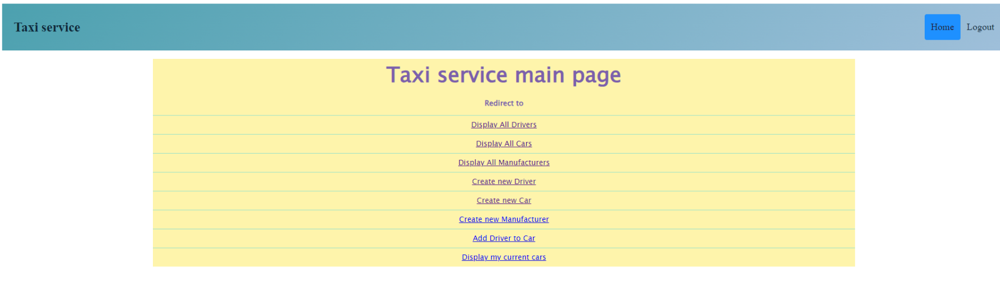
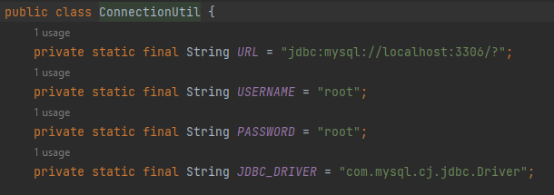

# 🚕 Taxi service app
## 📄 Project description:
 Simple web app that supports user authentication and have basic CRUD operations. Created using in-build java functionality sql and servlets



## Technology stack:
Java 11, MySQL, JSP, Maven

## 📄How to use app
1. Clone this repo to your ide
```
git@github.com:Rolik-Oleksandr/taxi-service-app.git
```
2. Execute queries from init_db.sql to create needed tables and run it.
3. Replace username, password and url in ConnectionUtil with your own.


4. Create new run configuration tomcat_local 
5. Run mvn package command in terminal. 
6. Use application)

4. Create new run configuration tomcat_local 
5. Run mvn package command in terminal. 
6. Use application)
